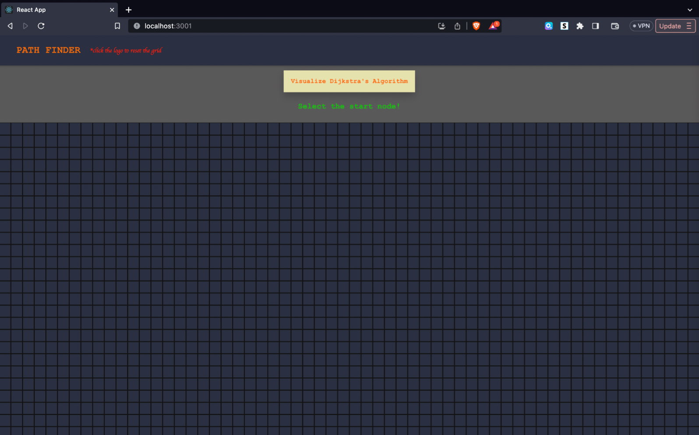
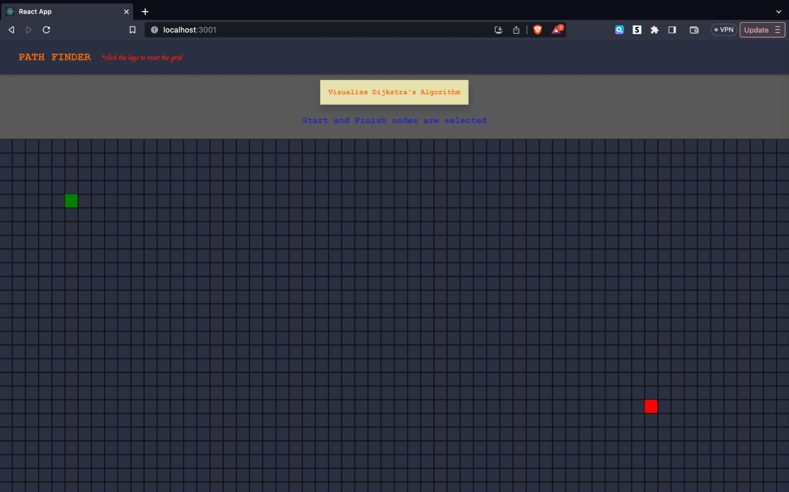
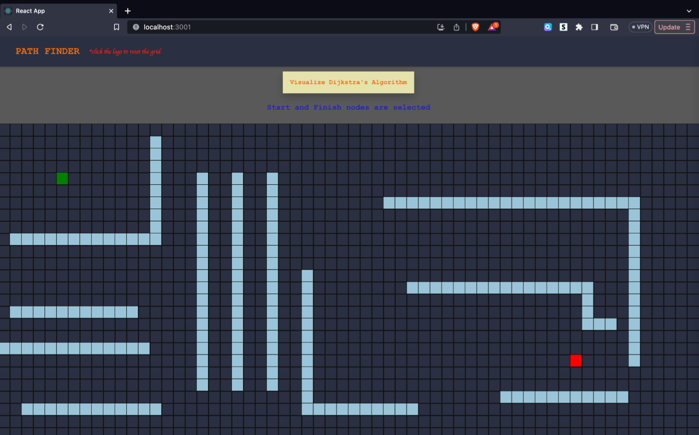
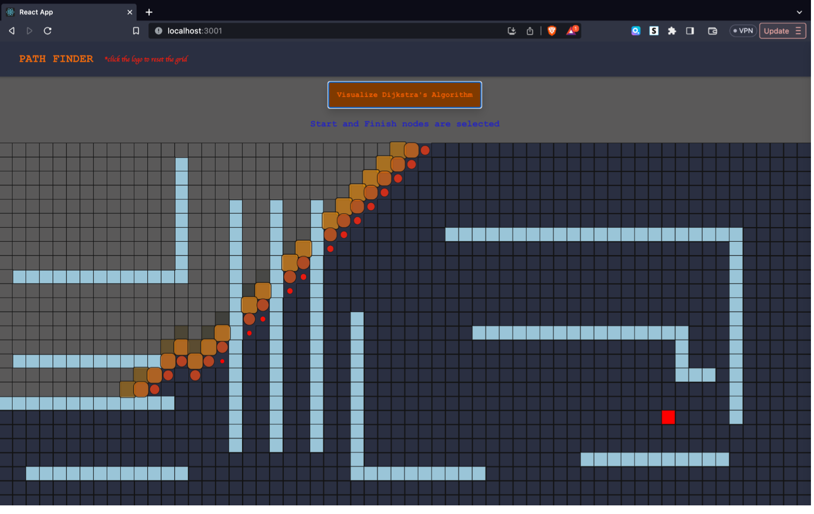

# PathQuest: Advanced Pathfinding Visualizer



## Overview

PathQuest is an interactive web application that allows users to explore and visualize popular pathfinding algorithms in action. Built with React and styled with TailwindCSS, this application provides a hands-on experience for understanding the principles behind algorithms such as Dijkstra's Algorithm, A* Search Algorithm, and Ford-Fulkerson for maximum flow problems.

## Features

### Multiple Algorithm Support
- **Dijkstra's Algorithm**: Guarantees the shortest path in weighted graphs
- **A* Search**: Uses heuristics to find paths more efficiently than Dijkstra's
- **Ford-Fulkerson**: Visualizes maximum flow in a network

### Interactive Grid
- Create and modify a grid-based map
- Set start and end points by clicking on nodes
- Add walls by clicking and dragging across the grid
- Add weighted nodes to simulate terrain difficulty
- Generate random mazes and obstacles

### Real-time Visualization
- Step-by-step animation of algorithm execution
- Color-coded nodes to indicate visited status, path, walls, and weights
- Smooth animations powered by Framer Motion

### Educational Features
- Algorithm information panel with complexity details and use cases
- Real-time metrics display (steps taken, execution time, path length/flow value)
- Toggle-able sidebar with algorithm explanations

### User Controls
- Algorithm selection dropdown
- Weight adjustment slider
- Visualization speed control
- Clear board and reset options

## Screenshots

### Home Screen


### Algorithm in Action


### Path Found


### Educational Panel


## Implementation Details

### Technology Stack
- **React 18**: Functional components with hooks for state management
- **TailwindCSS**: Modern utility-first CSS framework for styling
- **Framer Motion**: Animation library for smooth transitions

### Project Structure

```
src/
├── Algorithm/
│   ├── astarSearch.js     # A* search algorithm implementation
│   ├── dijkstra.js        # Dijkstra's algorithm implementation
│   └── ford_fulkerson.js  # Ford-Fulkerson algorithm for max flow
├── components/
│   ├── AlgorithmInfo/     # Educational panels about algorithms
│   ├── Controls/          # UI controls for algorithm selection and settings
│   ├── Grid/              # Grid component to render the visualization area
│   ├── Node/              # Individual node component with animations
│   └── Sidebar/           # Collapsible sidebar with algorithm details
├── hooks/                 # Custom React hooks
└── App.js                 # Main application component
```

### Key Components

- **PathfindingVisualizer**: Main component that orchestrates the visualization
- **Grid**: Renders the grid of nodes and handles mouse interactions
- **Node**: Individual cell in the grid with various states (wall, visited, path)
- **Controls**: UI elements for algorithm selection and visualization control
- **Sidebar**: Educational panel with algorithm details and metrics

### Algorithms

1. **Dijkstra's Algorithm**:
   - Guarantees the shortest path
   - Time Complexity: O(V²) or O(E + V log V) with priority queue
   - Space Complexity: O(V)

2. **A* Search**:
   - Uses heuristics to improve performance over Dijkstra's
   - Time Complexity: O(E) in the worst case
   - Space Complexity: O(V)

3. **Ford-Fulkerson**:
   - Finds maximum flow in a flow network
   - Time Complexity: O(E × max_flow)
   - Space Complexity: O(V²)

## Getting Started

### Prerequisites
- Node.js (v14 or later)
- npm or yarn

### Installation

1. Clone the repository:
   ```bash
   git clone https://github.com/yourusername/pathquest.git
   cd pathquest
   ```

2. Install dependencies:
   ```bash
   npm install
   ```

3. Start the development server:
   ```bash
   npm start
   ```

4. Open your browser and navigate to `http://localhost:3000`

## Usage

1. **Select an algorithm** from the dropdown menu
2. **Set start and end nodes** by clicking on the grid
3. **Add walls** by clicking and dragging across the grid
4. **Adjust weights** using the weight slider (for weighted algorithms)
5. **Click "Visualize"** to see the algorithm in action
6. **View the metrics** in the sidebar to understand algorithm performance
7. **Reset the board** to try different scenarios

## Future Enhancements

- Additional algorithms (Bellman-Ford, Floyd-Warshall)
- Custom maze generation algorithms
- User-defined heuristics for A*
- Save and share board configurations
- Mobile-responsive design
- Dark mode toggle

## License

This project is licensed under the MIT License - see the LICENSE file for details.

## Acknowledgments

- Inspired by various pathfinding visualizers and educational tools
- Built with React, TailwindCSS, and Framer Motion
